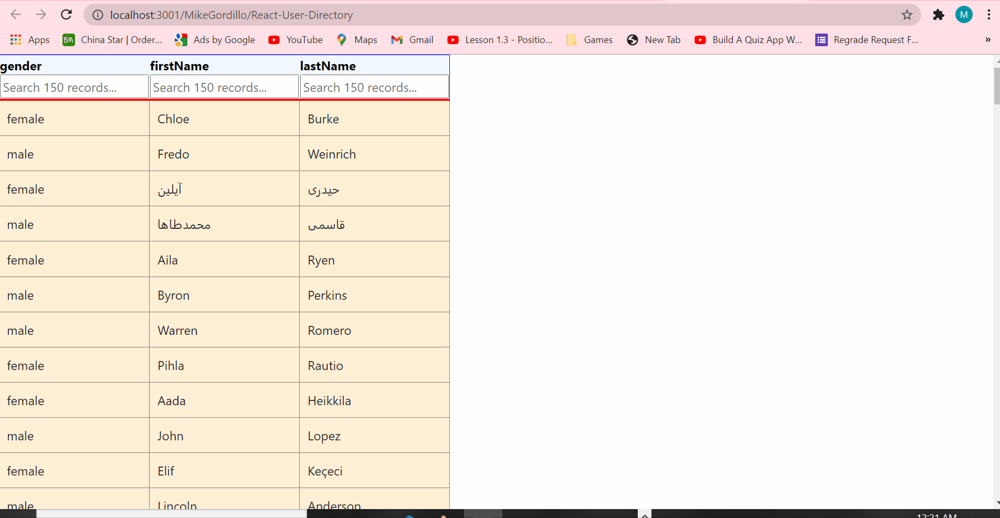
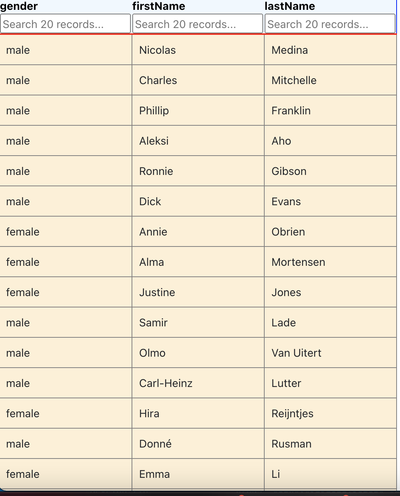

# React-User-Directory

        
## Name:Mike gordillo
## GitHub user name: https://github.com/MikeGordillo

## Table of contents:  
* [Description](#description)
* [Installation](#Installation)
* [Usage](#usage)
* [License](#license)
* [Testing](#testing)
* [Questions](#questions)
        
## Description:
* User directoy
## Installation:
* Clone repo, npm i, npm start
## Usage:
* 
## license:
* None
        
## Contributing:
n/a
* 
## Testing:
* n/a
## Questions:
* Contact Mike gordillo with any questions at mikegordillotattoo@gmail.com

https://github.com/MikeGordillo/README_md_Generator

      